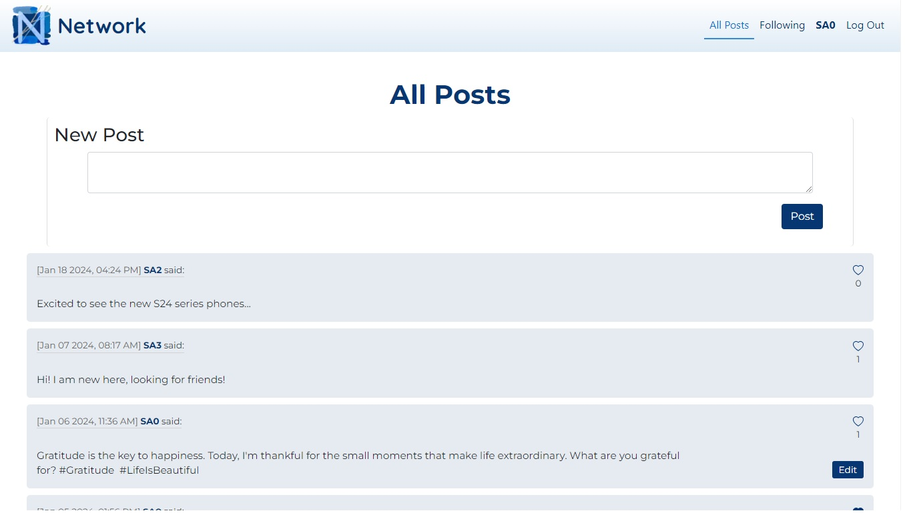
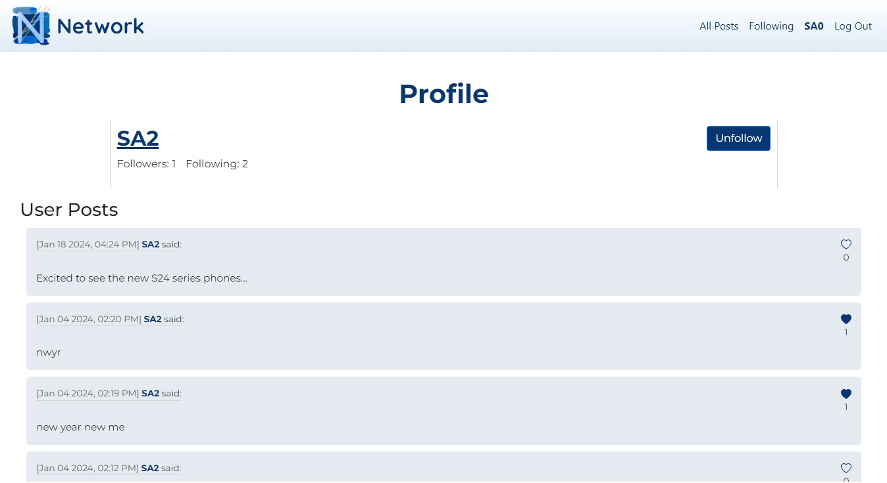

# Network

A social networking web app incorporating features such as post creation, user following, asynchronous editing and liking, and pagination, all implemented using Single Page Application architecture.

(*Implemented as part of the CS50 Web Project Course. [Project Requirements](https://cs50.harvard.edu/web/2020/projects/4/network/)*)

 